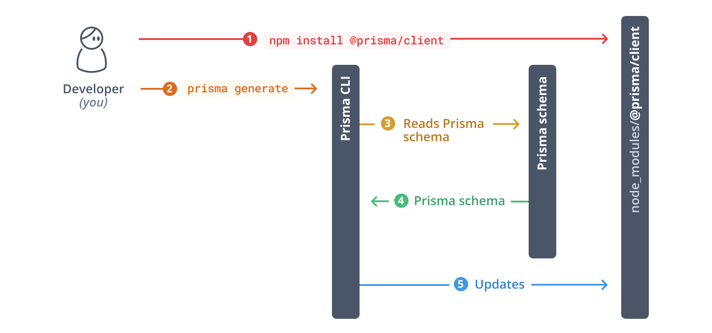

## 
- Backend: Node.js + Express.js (Google Cloud Run)
- Frontend: React.js + Tailwind CSS (Google Cloud / Firebase Hosting)
- Database: MongoDB Atlas

## FLOW
### Front
- recta app
- tailwindccss added.

### Back
- express .
- nodemon .
- 

## DB
- MongoAltas
- prisma 

> import { PrismaClient } from "../../../generated/prisma";

// if admin , middleware token vetfied how ...